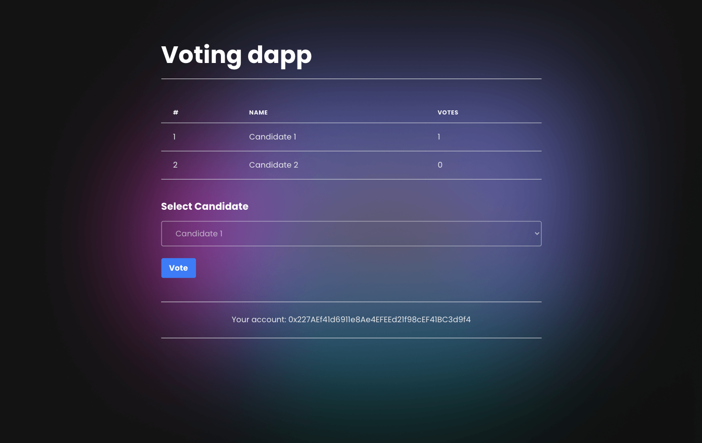

<h1>Voting Dapp</h1>

A basic voting dapp (decentralized application) written in Solidity & React.

<!-- &mdash; [usehooks-typescript.com](https://usehooks-typescript.com/) &mdash; -->

<!-- Badges -->

<!-- 
 -->

## Requires
- NodeJS
- npm
- git
- truffle (dapp EVM framework)
- Ganache (local blockchain)

Open http://localhost:3000, connect your MetaMask wallet, and vote. 
